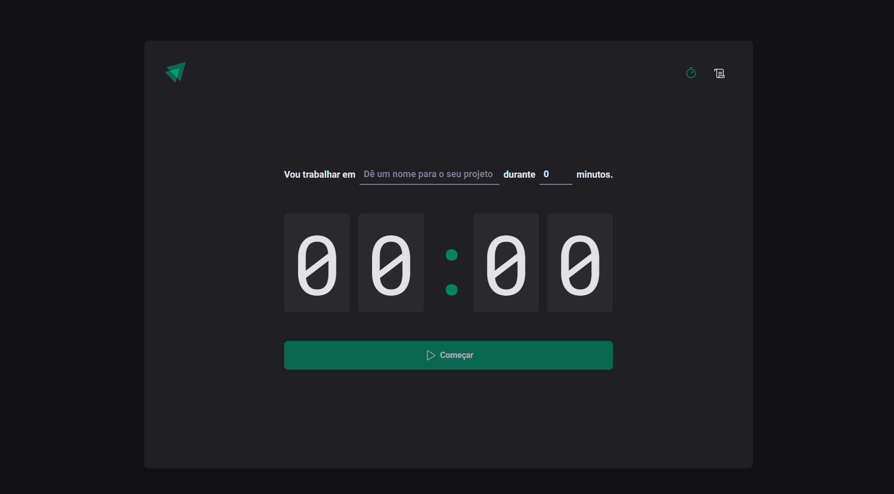
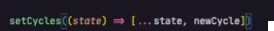
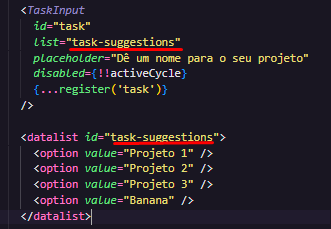
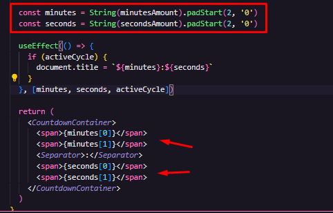
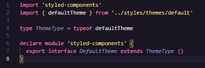
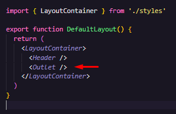
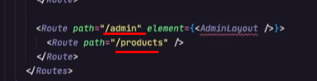
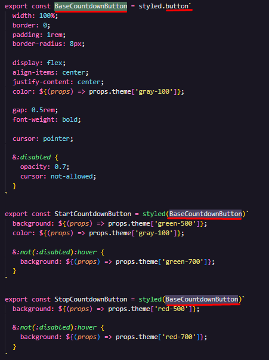
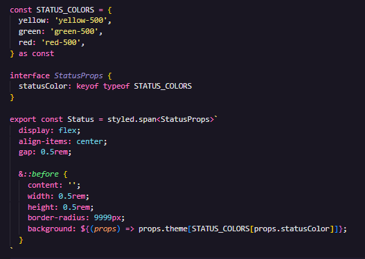

# Ignite Timer - Rocketseat

## Tabela do Conteudos

  * [Introdução](#introdução)
  * [Exposição do projeto](#exposição-do-projeto)
  * [Conhecimentos Adquiridos](#conhecimentos-adquiridos)
    * [Geral](#geral)
    * [Métodos do TypeScript](#métodos-do-typescript)
    * [Métodos de estilização do StyledComponents](#métodos-de-estilização-do-StyledComponents)
  * [Curiosidade](#curiosidade)
  * [Tecnologias](#tecnologias)

## Introdução

Esse é o segundo projeto apresentado na formação ReactJS do curso da Rocketseat.

# Exposição do projeto

  

# Conhecimentos Adquiridos

### Geral -

- Pude conhecer pela primeira vez o ESLint, que permite configurar diversas regras para padronizar a organização do código, normalmente utilizado em um time de uma empresa, que gosta de manter uma padronização na estrutura e visualização do código.

- Conteitos de Controlled e Uncontrolled anotados:
  - Controlled: Manter em tempo real a informação, sendo inserida dentro de um estado da minha aplicação.
  - Uncontrolled: Busca o valor da minha informação, somente quando precisarmos desse valor.

- Aprendi como utilizar o ReactHookForm que consigamos manipular e recuperar os dados dos nossos input ao submit do formulário (Ex: Register, Watch).

- Vi como podemos utilizar a biblioteca Zod para Schema de validações.

- Uma observação, sempre que uma alteração de estado depender do valor anterior, utilizar o formato de arrow function.

  

- Conheci uma técnica do HTML para inserir sugestões de textos no input.

  

- Descobri um novo método do JavaScript que é o `padStart()`, ele preenche uma string até um tamanho específioco com algum caractere, caso ela não tenha ocupado o tamanho ainda, adicionando no início.

  

### Métodos do TypeScript -

- Conheci um método de definição de tipos, onde que só é permitido arquivos de tipagem exclusivas do TypeScript.
Essa linha de código foi criada para poder exibir as propriedades do nosso defaultTheme!

  

- Aprendi sobre Outlet do ReactRouterDom, que é um espaço onde será ocupado por todo o conteúdo entre o Header e o Footer (Layout da Página).

  

- Também posso criar uma rota encadeada com outro layout padrão para diferentes caminhos da minha aplicação.

  

### Métodos de estilização do StyledComponents -

- Observei como criar e usar um componente estilizado de base para criar outros componentes estilizados.

  

- Achei bastante interessante como podemos criar uma tipagem no StyledComponents para atribuir as coras que o status da minha aplicação irá receber, baseado nas cores do meu defaultTheme.

  

## Curiosidade

A explicação sobre o Reducer foi complexa mas bastante produtiva, tenho certeza que irei revisar o conceito nos exemplos apresentados pelo Diego.

## Tecnologias

<ul>
<li>HTML</li>
<li>CSS</li>
<li>JavaScript</li>
<li>TypeScript</li>
<li>React</li>
</ul>